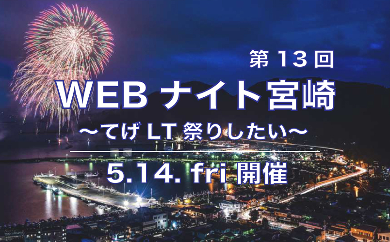
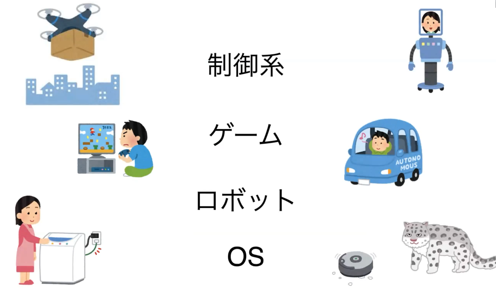
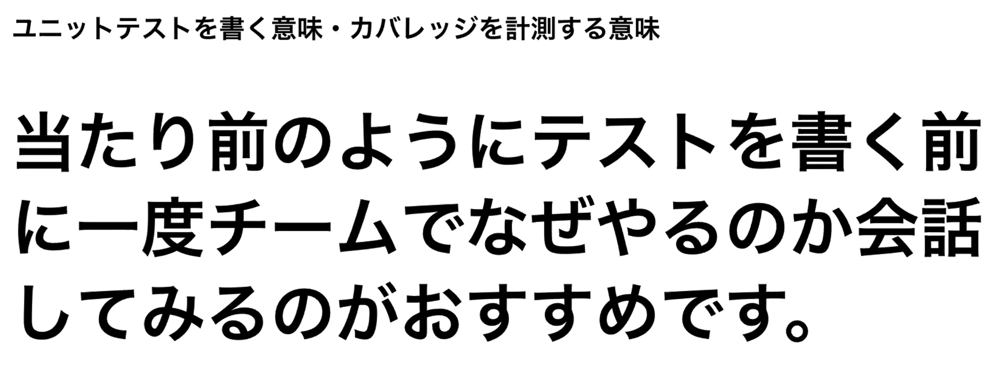
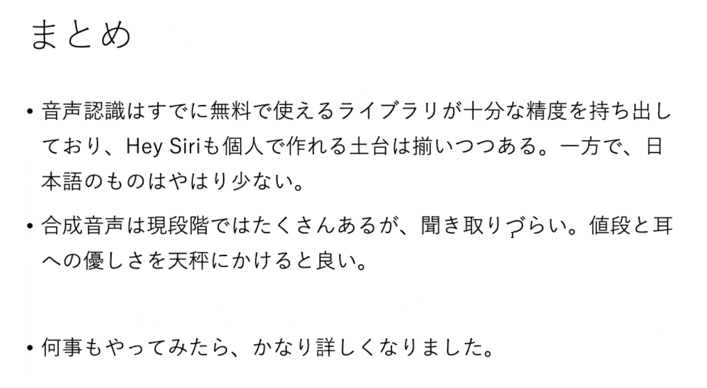

こんにちは。てげほげの桑畑です。
5/14 (金) に 13 回目となる Web ナイト宮崎を開催しました。
その様子をレポートします。

## 今回は LT 祭り

しばらく間が空いたこともあり、今回のテーマは特に限定せず自由に LT をしようということになりました。
題して「てげ LT 祭りしたい」。実際に集まったテーマも結構バラバラでした。
自分の知らないことに耳を傾けて幅広く知見を得られるのも勉強会の醍醐味かと思います。

告知した当初はオフライン(ATOMica 会場)とオンラインの同時開催の予定でしたが、宮崎県も緊急事態宣言が発令されたこともあり、オンラインのみの開催となりました。
僕自身もオフラインで参加できることを楽しみにしていましたが、またいずれ安全に開催できるタイミングが来ることを願っています。

### 桑畑: LeacTion!のアップデートとプチ勉強会へのいざない

[発表資料はこちら](https://speakerdeck.com/mather/updates-of-leaction-and-petit-meetup)

てげほげメンバーと協力して作っている勉強会向けコメントツールの LeacTion! のアップデートのお知らせを行いました。
発表の中で「今回のアップデート後の Firestore の請求が心配」ということを話していたのですが、請求額が大幅に減っていたことをここに述べておきます。
技術的な話は別の記事でお伝えできればと思います。

プチ勉強会については Web ナイト宮崎のような浅く広い大人数の勉強会もいいけど、狭く深い少人数の勉強会も良いですよ、という話でした。

### 伊藤: Code for Miyazaki 404

[発表資料はこちら](https://docs.google.com/presentation/d/16FyTDY6CxdC65EBQUOYnH4lAl6fvfQetBnrsxLKPIVc/edit)

続いて伊藤陽生さんの発表。Code for Miyazaki についてのお話です。

- Code for Japan: 「見たい未来は 自分でつくる」
- Code for Miyazaki: 「ともに考え、ともに作る」

どちらも活動を表す良いスローガンだなぁと思いました。

Code for の活動を通して「開発者と全く違う視点（行政など）からの反応が見れる」というのも面白いですね。

とはいえ、活動に関するモチベーションが必要だったり、
金銭的な部分について考えるべきこと(iOS アプリ開発者登録、サーバ費用)もあり、模索している状況のようです。

反応があるのは嬉しいことだと思いますので、ぜひ「みやざき防災アプリ」も使ってみて、フィードバックしていきましょう。

### さとすず: C, C++の可能性

株式会社ツクルのさとすずさん( [Twitter アカウント](https://twitter.com/satosuzu0430) )の発表です。
元々は職業訓練校や企業で PHP をやっていたところから、最近転職に伴い C, C++を業務で学び始めているとのこと。
PHP から C++に飛び込めるのはすごいですね…。

今回の LT は C, C++ について学んでいることを説明していただきました。
「どんな場面で使われているのか」「歴史的な経緯」「他の言語との関わり方」など、普段触っていない人には良い話だったのではないでしょうか。
他の言語の拡張機能などは C などで記述されているものもあったりするので、学ぶ価値はあると思います。

### minochan0925: GMO インターネットのコードレビューとマージリクエスト

GMO インターネットの柄本さんの発表です。
パン職人からのフロントエンドエンジニアへの転職というなかなかの経歴の持ち主です。

GitLab にマージリクエストがあったりマージ・デプロイのイベントを Chatwork に通知されるようです。
（通知が多すぎるのも問題のようなので通知先を限定しているとのこと）
他にも「コードレビューの完了を通知する」などの仕組みがあるようなので、各チームで効率よく動く仕組みが整理されていて面白いですね。

### くすたん: コロナ禍の鹿児島

鹿児島（大隅はほぼ宮崎）から参加いただいているくすたんさんの発表です。

鹿児島もコロナの影響はあるようですが、元々リモートワークで活動しているのでくすたんさんは問題なく活動できているとのことでした。

くすたんさんは 鹿児島.mk などのコミュニティを主催しており、Web ナイト宮崎と同じようにオフライン＋オンラインでの開催をしているそうです。
オンラインのみの開催にした場合に、常連ばかりになってしまったり、県外の勉強会もライバルになってしまうのは共通の課題だと感じました。
鹿児島のコミュニティとも交流を行っていきたいですね。

### 木目沢: ユニットテストとカバレッジの本質をチーム内で共有する

ZOZO テクノロジーズの木目沢さんの発表です。

ユニットテストを書くのは「品質をわかるようにするため」であって、テストを書くことで再設計やリファクタリングに挑戦できるようになることが強みです。
一方テストカバレッジが低いと「品質がわからない」ということになります。
実際何%以上にするべきかという具体的な基準は意味はないですが、リファクタリングなどを行える「安心感」が大事なようです。
ZOZO テクノロジーズでは SonarCloud を導入して可視化しているようです。

チーム内で「なぜテストを書くべきか」という認識を持つのも大事ですね。

### 川原: 音声認識と合成音声のライブラリ調査と、無料の範囲で試してみた

福岡からお越しの川原さんの発表です。川原さんは元アラタナの方で、現在は福岡で転職されたとのこと。

今回は仕事で関わっている音声認識・合成音声について調査したようです。

実際にデモをしながら LT をするのは面白いですね。
どちらも無料・有料のライブラリやサービスがあるようですが、無料でもかなりの精度で音声認識ができているようで驚きました。

### tenntenn: Go のはじめかた

メルペイ所属の [tenntenn さん](https://twitter.com/tenntenn)による Go 言語についての発表です。
宮崎出身で現在は苫小牧在住、六本木勤務（リモート）というなかなかのパワーワード。

Go 言語の特徴やチュートリアル、カンファレンス、コミュニティなどについて解説していただきました。
これらの情報があるとこれから始める人がとっつきやすくてありがたいと思います。
興味のある方は学んでみてはいかがでしょうか。

tenntenn さん自身も Go 言語の数百ベージに及ぶ丁寧な解説スライドを公開していたり、「みんなの Go 言語」の共著者だったりします。

### twsoccer_15: エンジニア転職活動を振り返ってみた

最近未経験から Web エンジニアに転職された[たつやさん](https://twitter.com/tatsuya0617)による転職活動の振り返りを発表していただきました。
**初 LT** です。

転職に際して次のような準備をしっかり行ってるのがすごいです。

- プログラミング言語の勉強
- 共同開発の能力不足に対してスクールで備える
- 自分の働きたい方向性について考える
- 企業研究
- ポートフォリオの作成

それでもなかなか内定がもらえなかったそうで、

- 職務経歴書と履歴書の添削
- ポートフォリオの見直し

などを行って改善した結果、内定が出たようです。

転職活動を通して「技術力だけではなく人柄や人間力も見られている」というメッセージをこれからエンジニアになりたい人に向けて伝えたいそうです。
組織の中ではコミュニケーションを取りながら協力し合うことが大事なので、私自身の経験からも共感しています。

### 大塚: Shopify の入り口

ノマドリのしんげん兄貴による Shopify の解説です。最近案件で利用したところからの学びを共有していただきました。

Shopify が注目されている理由として、各ブランドがブランドイメージを重要視しておりショッピングモールから自社サイトやマルチチャネルによる D2C へ移行していくニーズにマッチしていることが挙げられています。

Shopify はカートシステムとしての Web サービスであり、バックエンドシステムのサーバ管理が不要でデザインを自前で構築できる自由度や Shopify アプリ（プラグインのようなもの）で拡張できるそうです。

開発者目線では「セクション」という項目を設計しておくことで管理画面から変更できるようになるため、文言修正等の細かい保守対応のために開発を行わなくて良いなどのメリットもあるようです。

## Remo でオンライン懇親会

オンライン開催になったので Remo というサービスで少人数のグループに別れた懇親会を行いました。

それぞれのテーブルで近況を聞いたり楽しい話ができたようなので、今後もなんらかの形で懇親会は開催していきたいと思います。
LT では語りきれない話や最近の興味について自由に語れるので時間の許す方は気軽に懇親会にも参加してください。

集まるメンバーによってはインターネット老人会のような会話になってたりしちゃいましたが…😅

## まとめ

登壇頂いた方、参加いただいた方に改めて感謝いたします。
たとえオンラインでも集まってワイワイできる空間がそれぞれの励みになると思います。

次回以降のテーマは未定ですが、もし「こんなテーマも面白いんじゃない？」「こんなテーマで喋りたい・聞いてみたい」などのアイデアがあれば、てげほげのメンバーに提案いただけるとありがたいです。

ぜひ次回もお誘い合わせの上ご参加ください！
